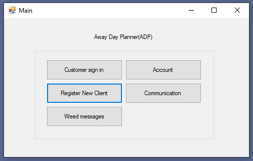
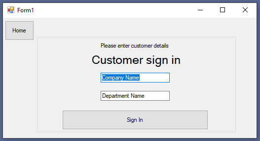
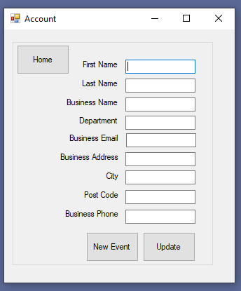

<!-- PROJECT LOGO -->
 

  

  <h3 align="center">C# Winforms</h3>

  

    A small university project an event booking system using C# and the Entity Framework
     
  

<!-- ABOUT THE PROJECT -->
## About The Project

A small university project an event booking system using C# and the Entity Framework

### Built With

* [C# .NET]()
* [VisualStudio 2019]()
* [Entity FrameWork]()

<!-- USAGE EXAMPLES -->
## Usage

Open VisualStudio solution "AwayDay3.sln" to compile and run from visual studio.
